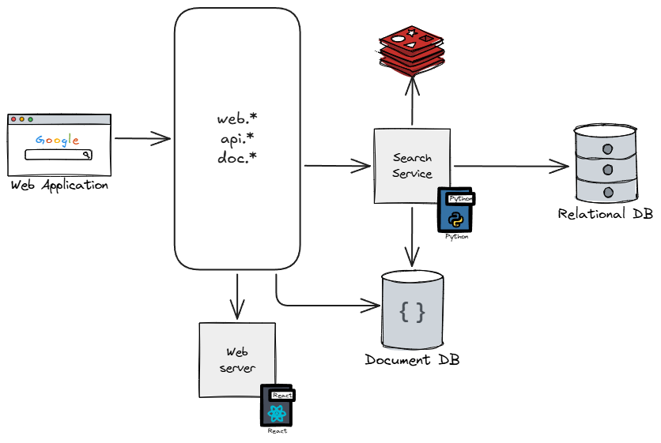
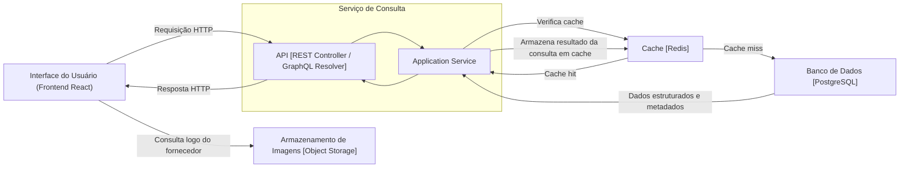
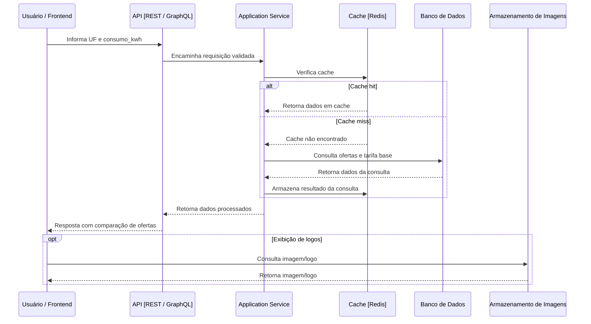
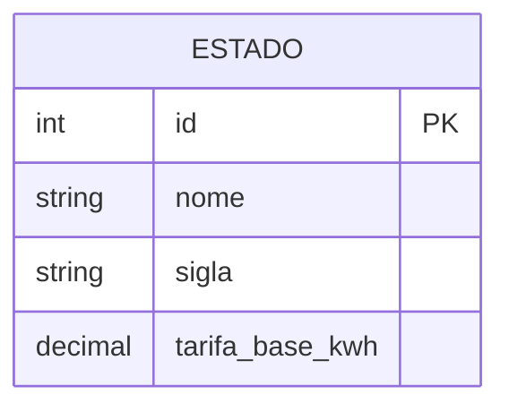
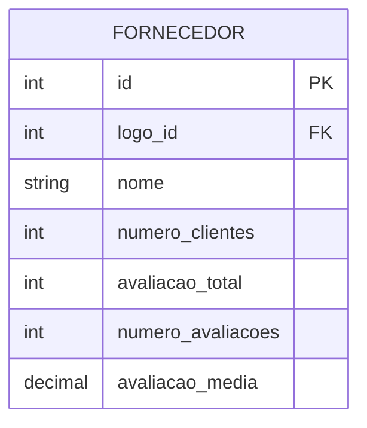
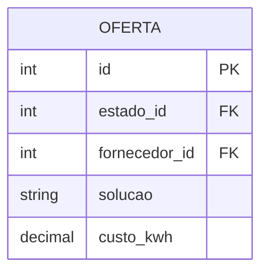
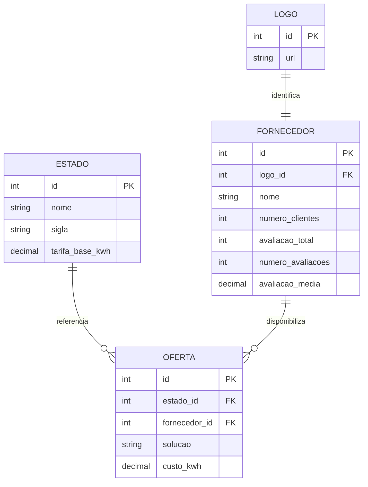

# Contexto do Problema

Empresas buscam reduzir custos com energia por meio da comparação entre diferentes fornecedores e modalidades de contratação disponíveis em seu estado.

A aplicação tem como objetivo permitir que essas empresas simulem e comparem opções de fornecimento de energia com base no consumo mensal informado e no estado selecionado.

---

# Objetivo do Produto

Permitir que empresas comparem o custo de energia entre diferentes fornecedores e soluções disponíveis em um estado, bem como em relação a uma tarifa base de referência do estado.

---

# Requisitos

## Requisitos Funcionais

### RF01 — Seleção de estado
O usuário deve poder selecionar uma UF para realizar a consulta.

### RF02 — Informar consumo mensal
O usuário deve poder informar seu consumo mensal de energia em kWh.

### RF03 — Consultar soluções disponíveis
Ao informar o consumo mensal e selecionar a UF, o sistema deve informar quais soluções estão disponíveis no estado selecionado.

As soluções consideradas pelo sistema são:
- GD
- Mercado Livre

### RF04 — Consultar fornecedores por solução
O sistema deve exibir quais fornecedores estão disponíveis para cada solução no estado selecionado.

### RF05 — Exibir comparação por fornecedor
O sistema deve apresentar, para cada fornecedor disponível:
- o custo estimado da contratação;
- a economia estimada em relação à tarifa base do estado;
- a economia percentual estimada.

### RF06 — Exibir comparação de economia por solução
O sistema deve apresentar um resumo da economia por solução, permitindo a comparação entre elas.

### RF07 — Tratar indisponibilidade de soluções
Caso uma solução não esteja disponível para o estado selecionado, o sistema deve informar essa indisponibilidade ao usuário.

## Regras de Negócio

### RN01 — Tarifa base por estado
Cada estado deve possuir uma tarifa base de comparação.

Exemplo conceitual:
- PR -> `tarifa_base_kwh(PR)`
- SP -> `tarifa_base_kwh(SP)`

### RN02 — Oferta de fornecedor por estado e solução
Um fornecedor pode atuar em um ou mais estados.

Para cada estado em que atua, o fornecedor pode ofertar:
- nenhuma solução;
- apenas GD;
- apenas Mercado Livre;
- ambas as soluções.

Cada oferta deve possuir um custo por kWh próprio, que depende da combinação:
- fornecedor;
- estado;
- solução.

### RN03 — Cálculo do custo base
O custo base de comparação deve ser calculado por:

`custo_base = consumo_kwh * tarifa_base_kwh(estado)`

### RN04 — Cálculo do custo do fornecedor
Para cada fornecedor e solução disponível, o custo estimado deve ser calculado por:

`custo_fornecedor = consumo_kwh * custo_kwh(fornecedor, estado, solucao)`

### RN05 — Cálculo da economia
Para cada fornecedor e solução disponível, a economia estimada deve ser calculada por:

`economia = custo_base - custo_fornecedor = consumo_kwh * (tarifa_base_kwh(estado) - custo_kwh(fornecedor, estado, solucao))`

### RN06 — Cálculo da economia percentual
Para cada fornecedor e solução disponível, a economia percentual deve ser calculada por:

`economia_percentual = economia / custo_base`

### RN07 — Tratamento de economia negativa
Caso `economia < 0`, o sistema deve exibir o valor negativo e identificá-lo como prejuízo estimado em relação à tarifa base.

### RN08 — Critério de ordenação dos resultados
Os fornecedores exibidos ao usuário devem ser ordenados, dentro de cada solução, da maior para a menor economia estimada.

### RN09 — Arredondamento e formatação
Os valores monetários e numéricos devem sempre utilizar tipos que garantam precisão para operações e serem apresentados com formatação adequada.
- moeda: 2 casas decimais;
- avaliacao: 1 casa decimal.

## Requisitos Não Funcionais

> Como os requisitos não funcionais não foram definidos no problema, foram inferidos com base no domínio.

### RNF01 — Desempenho
O sistema deve responder às consultas em até 300ms para uma boa experiência de uso.

### RNF02 — Volume inicial
A solução deve considerar um cenário inicial de baixo volume de requisições.

### RNF03 — Usabilidade
A interface deve permitir que o usuário realize a consulta de forma simples e compreensível, com clareza na apresentação dos resultados comparativos.

---

# Restrições

## Restrições de Negócio

- Todos os dados da aplicação devem ser fictícios.

## Restrições Técnicas

- O frontend deve ser desenvolvido em **React**.
- O backend deve ser desenvolvido em **Python ou Node.js**.

> Para o desafio técnico, o backend foi definido em **Python**, com uso do framework **Flask**, em alinhamento às tecnologias atualmente utilizadas pela empresa.
> Tenho atuação agnóstica em relação a linguagens e frameworks, o que me permite transitar com segurança entre diferentes stacks. Também possuo projetos desenvolvidos com **FastAPI**, **NestJS**, **AdonisJS**, etc., disponíveis no meu [GitHub pessoal](https://github.com/xBu3n0), caso seja de interesse avaliar minha experiência com outras tecnologias.

---

# Diferenciais Implementados

- Integração com **GraphQL**.
- Testes automatizados no frontend.
- Testes automatizados no backend.
- Containerização com **Docker**.
- Pipeline de CI/CD com Github workflows.
- Observabilidade básica utilizando **OpenMetrics**.

---

# Domínio do Problema (**Ajustar depois**)

O domínio do problema consiste na comparação de ofertas de energia para empresas, considerando:

- o estado em que a contratação será realizada;
- o consumo mensal informado pela empresa;
- os fornecedores que atuam no estado selecionado;
- as soluções ofertadas por cada fornecedor;
- a tarifa base de referência do estado.

---

# Modelagem de Domínio

## Entidades

### Estado

Representa a unidade federativa na qual a consulta é realizada, servindo como base para a tarifa de referência e para a disponibilidade de ofertas.

### Fornecedor

Representa uma empresa fornecedora de soluções de energia.

### Logo

Representa os metadados relacionados à imagem/logo de um fornecedor.

### Solução
Representa o tipo de contratação oferecido ao cliente.

**Valores possíveis:**
- GD
- Mercado Livre

### Oferta

Representa a atuação de um fornecedor em um estado específico para uma solução específica.

## Relações do Domínio

- Um **Estado** possui uma tarifa base de referência.
- Um **Fornecedor** pode possuir zero ou mais **Ofertas**.
- Uma **Oferta** pertence a exatamente um **Fornecedor**.
- Uma **Oferta** pertence a exatamente um **Estado**.
- Uma **Oferta** pertence a exatamente uma **Solução**.

## Restrições de Domínio

* O custo por kWh de uma oferta deve ser maior que zero.
* O consumo mensal informado pelo usuário deve ser maior que zero.
* O nome do fornecedor não pode ser vazio.
* O nome do fornecedor não pode conter espaços em branco no início ou no fim.
* A UF deve ser composta por exatamente duas letras maiúsculas.
* A tarifa base do estado deve ser maior que zero.
* Uma oferta deve estar associada a exatamente um fornecedor, um estado e uma solução.
* Não deve existir duplicidade de oferta para a mesma combinação:
  * fornecedor;
  * estado;
  * solução.

---

# Arquitetura Proposta

## Visão Geral

A solução pode ser composta por:

* uma aplicação frontend para interação com o usuário;
* um backend responsável pela consulta e processamento das regras;
* um banco de dados para armazenamento estruturado;
* um mecanismo de cache para reduzir latência em consultas repetidas;
* um armazenamento de imagens para logos dos fornecedores, caso necessário.

## Arquitetura Simplificada





## Justificativa Arquitetural

* O frontend centraliza a interação do usuário com a funcionalidade de consulta.
* O backend concentra a aplicação das regras de negócio e o cálculo dos valores comparativos.
* O banco de dados armazena estados, fornecedores, soluções, ofertas e tarifas base.
* O cache pode ser utilizado para acelerar consultas repetidas.
* O armazenamento de imagens pode ser usado para servir logos de fornecedores sem sobrecarregar o backend.

---

# Fluxo do Sistema

## Consulta de ofertas por estado

1. O usuário seleciona uma UF.
2. O usuário informa o consumo mensal em kWh.
3. O frontend envia a requisição ao backend.
4. O backend valida os dados de entrada.
5. O backend busca as ofertas disponíveis para o estado informado.
6. O backend calcula:

* custo base;
* custo por fornecedor;
* economia;
* economia percentual.

7. O backend organiza os resultados conforme o critério definido.
8. O sistema retorna ao frontend os dados consolidados para exibição.

## Diagrama de Sequência



---

# Design da API

## Operação principal

**Entrada esperada:**

* `uf`
* `consumo_kwh`

**Saída esperada:**

* tarifa base do estado;
* lista de soluções disponíveis;
* lista de fornecedores por solução;
* custo estimado por fornecedor;
* economia estimada por fornecedor;
* economia percentual por fornecedor;
* resumo consolidado por solução.

**Formato da API:**

* REST e GraphQL

**Exemplo de contrato:**

* GET /api/v1/ofertas?uf=SP&consumo_kwh=5000

* Query GraphQL:

```graphql
query (**Ajustar depois**)(uf: "SP", consumo_kwh: "5000") {
  tarifaBase
  ofertas {
    solucao
    custoEstimado
    economiaEstimado
    economiaPercentual
    fornecedores {
      nome
      logo { url }
    }
  }
}
```

---

# Armazenamento de Dados

## Estruturas principais

### Estado



### Fornecedor



> `numero_clientes` possivelmente pode ser separado em outra tabela para maior consistência.
> `avaliacao_total` foi para manter a consistencia para divisão

### Oferta

Representa a atuação de um fornecedor em um estado específico para uma solução específica.

#### Solução (Enum)

Representa o tipo de contratação oferecido ao cliente.

**Valores possíveis:**

* GD
* Mercado Livre



### Modelo completo com relacionamentos


